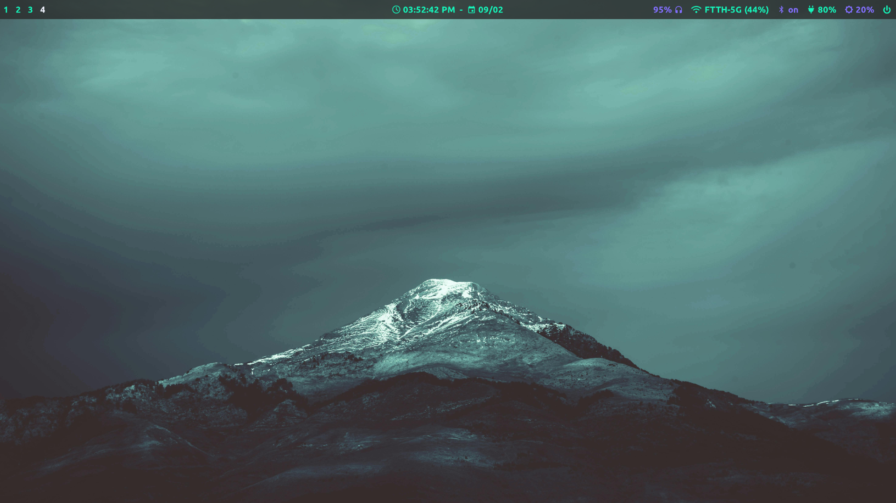

# README

## Screenshots



## Wifi connect

```
nmcli device wifi connect <SSID> --ask
```

## Update Mirrors

```
sudo pacman -S reflector
```

```
sudo cp /etc/pacman.d/mirrorlist /etc/pacman.d/mirrorlist.bak
```

```
sudo reflector --verbose --country 'India' --sort rate --save /etc/pacman.d/mirrorlist
```

## ZSH setup

Install zsh

```
sudo pacman -S zsh
```

Install oh-my-zsh

```
sh -c "$(curl -fsSL https://raw.githubusercontent.com/ohmyzsh/ohmyzsh/master/tools/install.sh)"
```

```
git clone https://github.com/zsh-users/zsh-autosuggestions.git $ZSH_CUSTOM/plugins/zsh-autosuggestions
```

```
git clone https://github.com/zsh-users/zsh-syntax-highlighting.git $ZSH_CUSTOM/plugins/zsh-syntax-highlighting
```

### Clone the repo

```
git clone --bare https://github.com/govtx86/hyprland-dotfiles.git $HOME/.cfg
```

Add the alias (in zsh shell)

```
echo "alias dot='/usr/bin/git --git-dir="$HOME/.cfg/" --work-tree="$HOME"'" >> ~/.zshrc
```

Apply the dotfiles

```
dot checkout -f
```

```
dot config --local status.showUntrackedFiles no
```

## Programs

### Hyprland

```
sudo pacman -S hyprland base-devel ghostty nemo rofi-wayland neovim firefox rofi-emoji
```

The configs are in `.config/hpyr/hyprland.conf`

### Yay setup

```
git clone https://aur.archlinux.org/yay-bin.git
```

```
cd yay-bin
makepkg -si
```

### Essential Programs

```
sudo pacman -S polkit-kde-agent sddm xdg-desktop-portal-hyprland dunst waybar hyprpaper cliphist grim slurp swaylock playerctl pavucontrol brightnessctl ttf-firacode-nerd noto-fonts-emoji ttf-ubuntu-nerd
```
```
sudo systemctl enable sddm
```

```
yay -S otf-font-awesome
```

```
yay -S visual-studio-code-bin
```

### Additional Programs

```
sudo pacman -S htop fastfetch
```

```
yay -S cava
```

Set gtk dark theme

```
yay -S gnome-themes-extra adwaita-qt5-git numix-icon-theme-git
```
```
gsettings set org.gnome.desktop.wm.preferences theme "Adwaita-dark"
gsettings set org.gnome.desktop.interface gtk-theme "Adwaita-dark"
gsettings set org.gnome.desktop.interface icon-theme "Numix"
```

### Media apps

```
sudo pacman -S vlc vlc-plugins-all gwenview
```

### Disable recent files
```
dconf write /org/gnome/desktop/privacy/remember-recent-files false
```
```
dconf write /org/cinnamon/desktop/privacy/remember-recent-files false
```

### Bluetooth setup

```
sudo pacman -S blueman
```

Start and enable bluetooth
```
sudo systemctl enable --now bluetooth.service
```

### Nvidia driver enable
Enable DRM modeset by creating file `/etc/modprobe.d/nvidia.conf` containing:
```
options nvidia_drm modeset=1 fbdev=1
```
​
Blacklist Nouveau drivers by creating file `/etc/modprobe.d/blacklist.conf` containing:

```
blacklist nouveau
options nouveau modeset=0
```
Install Linux headers
```
sudo pacman -S linux-headers
```
Then run `sudo mkinitcpio -P` and reboot.

Verify with `lsmod | grep nvidia` and look for nvidia_drm and check with `nvidia-smi`.

### Git setup

```
git config --global user.name "username"
git config --global user.email "email"
git config --global init.defaultBranch main
```

Github auth

```
sudo pacman -S github-cli
gh auth login
```

### ASUS control

```
yay -S rog-control-center
```

```
yay -S supergfxctl
```

```
sudo systemctl enable supergfxd
sudo systemctl start supergfxd
supergfxctl --mode Hybrid
```

### Battery charge limit

```
sudo pacman -S tlp
```

```
sudo systemctl enable tlp
sudo systemctl start tlp
```

Edit(sudo) /etc/tlp.conf and add

```
STOP_CHARGE_THRESH_BAT0=80
```

Restart tlp service

### Add windows to GRUB

```
sudo pacman -S os-prober
```

```
sudo nvim /etc/default/grub
```

Set

```
GRUB_DISABLE_OS_PROBER="false"
```

```
sudo grub-mkconfig -o /boot/grub/grub.cfg
```

### Disable hibernation

Fixed wifi disconnect on lid close

```
sudo nvim /etc/systemd/logind.conf
```

Set

```
HandleLidSwitch=ignore
HandleLidSwitchExternalPower=ignore
HandleLidSwitchDocked=ignore
```
